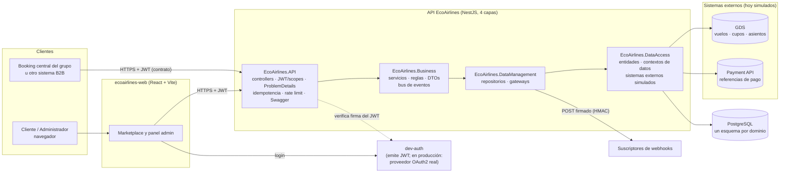
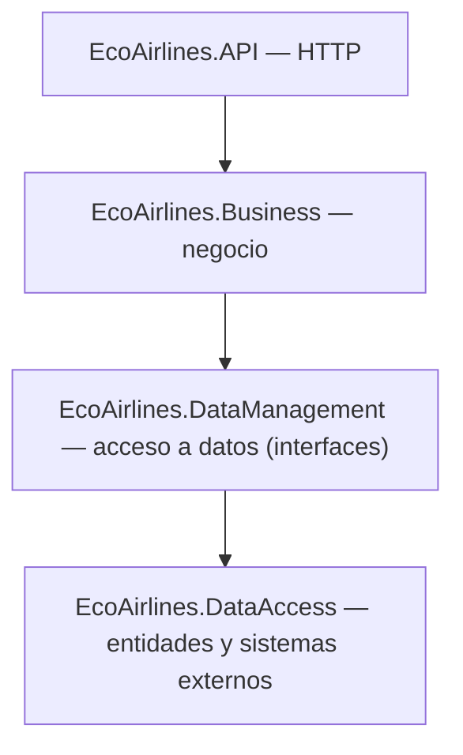
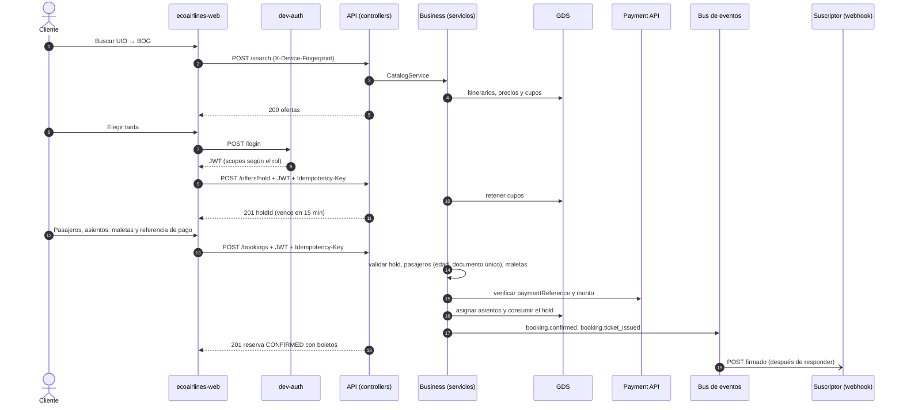
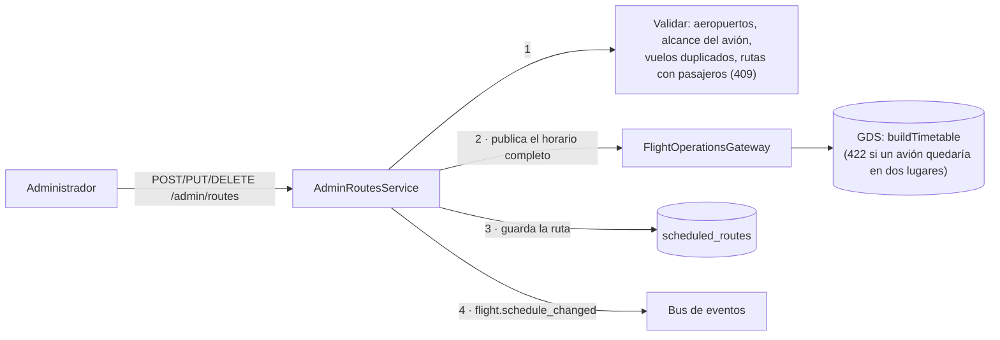
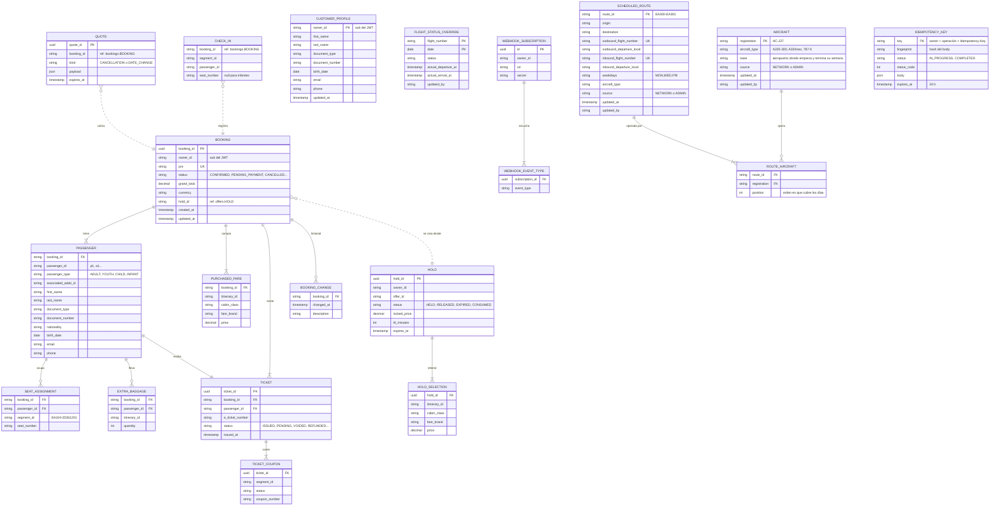
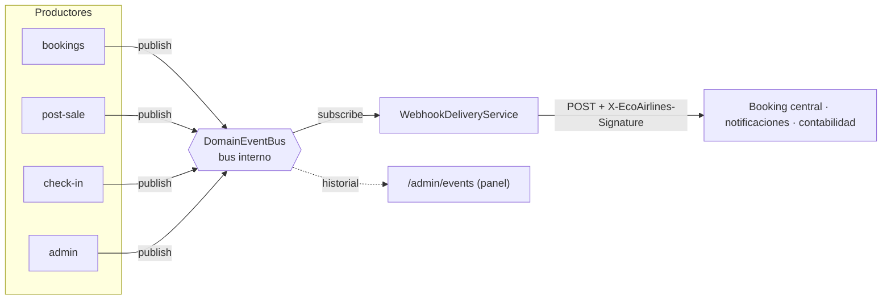
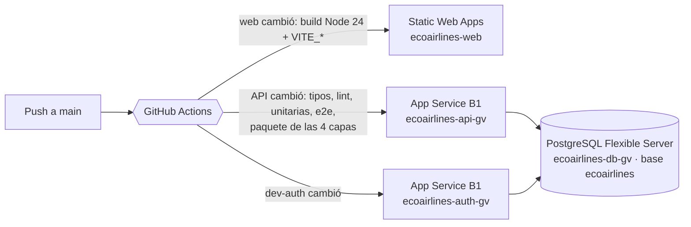

# ARQUITECTURA — AppVuelos / EcoAirlines

Documento técnico de la solución: componentes, capas, flujo de una compra, horario, modelo de datos, eventos, seguridad y despliegue.
Los diagramas están en **Mermaid**: GitHub (y VS Code con la extensión de Mermaid) los dibujan directamente.

**En línea:** web https://nice-hill-090e19c10.1.azurestaticapps.net · API y Swagger
https://ecoairlines-api-gv-fjfaa7b5geg3hphs.brazilsouth-01.azurewebsites.net/docs

| Documento relacionado | Contenido |
|-----------------------|-----------|
| [`contract/vuelos-openapi.yaml`](contract/vuelos-openapi.yaml) | Contrato de la API (fuente de verdad) |
| [`contract/ecoairlines-extensions.yaml`](contract/ecoairlines-extensions.yaml) | Endpoints propios fuera del contrato |
| [`EVENTOS.md`](EVENTOS.md) | Catálogo y diseño de eventos (SOA/EDA) |
| [`EcoAirlines.API/README.md`](EcoAirlines.API/README.md) | Detalle de configuración, seguridad y pruebas |
| [`PRUEBASSW.md`](PRUEBASSW.md) | Guía de pruebas en Swagger |
| [`DESPLIEGUE_AZURE.md`](DESPLIEGUE_AZURE.md) | Despliegue en Azure paso a paso |

---

## 1. Componentes

| Componente | Tecnología | Responsabilidad |
|------------|------------|-----------------|
| `ecoairlines-web` | React 19, Vite 8, TypeScript | Marketplace (búsqueda, compra, postventa, check-in) y panel de administración |
| `dev-auth` | Node (driver `pg`) | Simula el servidor OAuth2 del contrato: registro, login y JWT con scopes según el rol; cuentas en PostgreSQL (`auth.users`). Su documento OpenAPI (`dev-auth/openapi.yaml`) aparece en el selector de Swagger de la API para registrarse e iniciar sesión desde ahí |
| API EcoAirlines | NestJS 12, Node 24, TypeScript | Implementa las 22 operaciones del contrato y las extensiones propias |
| GDS simulado | `MockGdsService` | Horario publicado, búsqueda, precios, cupos, asientos, estado de vuelo |
| Payment API simulada | `MockPaymentApiService` | Verifica referencias de pago (aprobado, pendiente o rechazado). La API nunca ve tarjetas |
| Datos | PostgreSQL (Azure Database for PostgreSQL Flexible Server) | Un esquema por dominio; sin `DATABASE_URL`, en memoria (desarrollo y pruebas). Ver sección 5 |
| Webhooks | `HttpWebhookDispatcherGateway` | Entrega los eventos a los sistemas suscritos (sección 6) |

---

## 2. Capas de la API

Cada capa es un *workspace* npm (como un proyecto `.csproj` en una solución .NET) y **solo usa las capas inferiores**:

| Capa | Carpetas | Ejemplo |
|------|----------|---------|
| API | `controllers/<dominio>`, `auth`, `middleware`, `interceptors`, `security`, `docs`, `observability` | `BookingsController` recibe `POST /bookings`, valida el DTO y decide `201` o `202` |
| Business | `services/<dominio>`, `rules`, `dto`, `exceptions`, `common/events` | `BookingsService.create`: valida el hold, los pasajeros y el pago, y asigna asientos |
| DataManagement | `interfaces/<dominio>`, `repositories/<dominio>`, `gateways/<dominio>` | `BookingRepository` (interfaz) y su implementación sobre la tabla del contexto `bookings` (PostgreSQL o memoria) |
| DataAccess | `entities/<dominio>`, `context`, `external/gds`, `external/payment`, `seed` | `BookingRecord`, `BookingsDataContext`, `MockGdsService`, `timetable.ts` |

### Dominios

| Dominio | Del contrato | Responsabilidad |
|---------|:------------:|-----------------|
| search | ✅ | Búsqueda y mapa de asientos |
| offers | ✅ | Holds: cupo y precio congelados por 15 min |
| bookings | ✅ | Reservas, emisión de boletos, listado; fachada pública para los demás |
| post-sale | ✅ | Maletas, cambio de fecha, cancelación |
| check-in | ✅ | Check-in y pases de abordar |
| flight-status | ✅ | Estado operativo del vuelo |
| webhooks | ✅ | Suscripciones y entrega de eventos |
| customers | Extensión | Perfil del cliente |
| admin | Extensión | Panel: indicadores, ocupación, flota, estado de vuelos, **CRUD de rutas programadas**, eventos |

**Reglas que verifica `EcoAirlines.API/test/architecture.spec.ts`:**
- Ninguna capa importa una superior.
- Un dominio no toca los repositorios, gateways, entidades ni contextos de otro: solo su API pública (`BookingsFacade`, `HoldService`,
  `FlightStatusService`).
- Dependencias permitidas: `admin → bookings`, `admin → flight-status`, `bookings → offers`, `check-in → bookings`,
  `post-sale → bookings`.
- El código compartido (`common/`, como el bus de eventos) no depende de ningún dominio.

---

## 3. Flujo de una compra

**Si el pago queda pendiente** (`pay_async_…`), `POST /bookings` responde **202 `PENDING_PAYMENT`** y publica
`booking.ticket_issuing`. Un proceso diferido confirma la reserva y publica `booking.confirmed` y `booking.ticket_issued`.

**Garantías del flujo:**
- **El dueño sale del JWT:** el `sub` del token es el dueño del hold y de la reserva. El body nunca lo decide.
- **Idempotencia:** la misma `Idempotency-Key` devuelve la misma respuesta sin duplicar la reserva ni el cobro.
- **Orden de los pasos:** nada se consume ni se asigna si una validación previa falla.
- **Errores:** todos salen en formato `ProblemDetails` con el `code` del contrato.

---

## 4. Horario de vuelos y rutas programadas

- **Rutas programadas.** Cada una es una línea de ida y vuelta con sus días y su tipo de avión. Al arrancar hay **90 rutas de la red
  base**: todos los aeropuertos conectados con todos, con 2 vuelos diarios por sentido. El administrador puede **crear, editar y dar
  de baja** rutas desde el panel (`/admin/routes`).
- **`buildTimetable(routes)`** (`DataAccess/seed/timetable.ts`):
  - convierte las rutas en el horario semanal, vuelo por vuelo;
  - asigna aviones dedicados con base en el origen;
  - valida que ningún avión esté en dos lugares a la vez y que todos vuelvan a su base al cerrar la semana.
- **Publicación.** El horario se publica en el GDS, que vende **91 días** (13 semanas exactas) desde hoy. Cada día entra uno nuevo.
- **Rutas con pasajeros.** No se editan ni se dan de baja (`409`). Para esos vuelos se usa el estado operativo (`CANCELLED`, `DELAYED`).
- **Flota** (`/admin/aircraft`):
  - el administrador registra aviones (tipo y base; la matrícula se asigna sola), cambia su base o los retira (solo si no operan
    rutas);
  - al crear o editar una ruta puede **elegir los aviones**: deben ser del tipo de la ruta, tener base en el origen y alcanzar para
    los días elegidos;
  - si no elige, se conservan los que ya tenía y se agregan aviones nuevos a la flota si faltan.
- **Tipos de avión.** Son datos maestros (mapa de asientos, alcance, tiempo en tierra): se consultan en `/admin/aircraft-types`, no se
  editan.

---

## 5. Modelo de datos

**Cómo se guarda hoy (V1.M):** cada **contexto de datos** (`DataAccess/src/context`, equivalente a un `DbContext`) es una base de
datos del diseño, y su dominio es el único que la usa. Con `DATABASE_URL`, cada contexto es un **esquema de PostgreSQL**:
- cada **agregado** es una fila con su documento **JSONB** (`id`, `data`, `updated_at`);
- las tablas se crean solas al arrancar y se cargan en memoria;
- cada cambio se escribe en la base, en orden;
- sin la variable, todo queda en memoria (desarrollo y pruebas).

El diagrama muestra el **modelo lógico**: las entidades y relaciones que contienen esos documentos. Es también el destino si más
adelante se normalizan las tablas.

- **Dentro de un contexto:** relaciones normales con claves foráneas.
- **Entre contextos:** solo referencias por id (líneas punteadas). No hay claves foráneas entre bases distintas, para poder separar
  cada dominio como microservicio.

| Base de datos (esquema) | Contexto | Dominio dueño | Entidades |
|----------------------|-----------------|---------------|--------|
| `bookings` | `BookingsDataContext` | bookings | BOOKING, PASSENGER, SEAT_ASSIGNMENT, EXTRA_BAGGAGE, PURCHASED_FARE, TICKET, TICKET_COUPON, BOOKING_CHANGE |
| `offers` | `OffersDataContext` | offers | HOLD, HOLD_SELECTION |
| `post-sale` | `PostSaleDataContext` | post-sale | QUOTE |
| `check-in` | `CheckInDataContext` | check-in | CHECK_IN |
| `customers` | `CustomersDataContext` | customers | CUSTOMER_PROFILE |
| `flight-status` | `FlightStatusDataContext` | flight-status | FLIGHT_STATUS_OVERRIDE |
| `webhooks` | `WebhooksDataContext` | webhooks | WEBHOOK_SUBSCRIPTION, WEBHOOK_EVENT_TYPE |
| `schedule` | `AdminDataContext` | admin | SCHEDULED_ROUTE, AIRCRAFT, ROUTE_AIRCRAFT |
| `idempotency` | `IdempotencyDataContext` | transversal | IDEMPOTENCY_KEY |

**Datos que no son nuestros:** el inventario (cupos y asientos) vive en el **GDS** y los pagos en la **Payment API**. Son sistemas
externos: la API los consulta mediante gateways y no los copia en sus tablas.

**Tablas físicas en PostgreSQL** (cada una con `id text PRIMARY KEY`, `data jsonb`, `updated_at`):

| Esquema | Tablas | Contenido de cada fila |
|---------|--------|------------------------|
| `bookings` | `bookings` | Reserva completa: pasajeros, asientos, maletas, boletos, historial, tarifas |
| `offers` | `holds` | Hold con sus selecciones y precio bloqueado |
| `post_sale` | `cancellation_quotes`, `date_change_offers` | Cotización u oferta con su vencimiento |
| `check_in` | `check_ins` | Asiento por segmento y pasajero de una reserva |
| `customers` | `profiles` | Perfil del cliente (por `sub`) |
| `flight_status` | `overrides` | Estado fijado por un administrador (vuelo + fecha) |
| `webhooks` | `subscriptions` | Suscripción con sus eventos y secreto |
| `idempotency` | `claims` | Respuesta guardada de una `Idempotency-Key` (24 h) |
| `schedule` | `routes`, `aircraft` | Ruta programada con sus aviones; avión de la flota |
| `gds` | `inventory`, `seats`, `meta` | Sistema externo simulado: cupos por segmento y cabina, asientos asignados |
| `payment` | `used_references` | Sistema externo simulado: referencias de pago ya usadas |
| `auth` | `users` | dev-auth: cuentas con contraseña derivada (scrypt) |

**Por qué documentos JSONB:**
- Los agregados del contrato (una reserva con pasajeros, boletos y asientos) se leen y escriben siempre completos.
- Las relaciones entre dominios son solo referencias por id.
- Los repositorios no cambiaron.

**Límite y cómo crecer:** la memoria es la copia de trabajo, así que la API corre como **una instancia**. Para escalar a varias, los
repositorios pasarían a consultar PostgreSQL directamente (o con TypeORM, como la plantilla), sin tocar servicios ni controllers.

---

## 6. Eventos (SOA/EDA)

El catálogo completo de eventos, el formato, la firma, los reintentos y el camino hacia un broker (RabbitMQ o Kafka) están en
[`EVENTOS.md`](EVENTOS.md).

---

## 7. Seguridad y operación (resumen)

| Tema | Implementación |
|------|----------------|
| Autenticación | JWT verificado: firma, `exp`, `iss`, `aud`; rechaza `alg: none`. En producción, un proveedor OAuth2 real (`AUTH_JWKS_URL`) |
| Autorización | Scopes del contrato (`flights:*`) y propios (`ecoairlines:profile`, `ecoairlines:admin`). Recurso ajeno → `404` |
| Entrada | DTOs con las reglas del contrato, `additionalProperties: false`, body ≤ 100 kb, saneamiento de claves peligrosas |
| Abuso | Rate limit por IP (`429` con `Retry-After`) |
| Cabeceras | helmet, CORS con lista blanca, HSTS en producción |
| Trazabilidad | `X-Request-Id` en cada respuesta, log de acceso sin datos sensibles, observabilidad en `/admin/observability` |
| Webhooks | URL anti-SSRF en producción (también al enviar), firma HMAC-SHA256 con el `secret` |
| Configuración | Se valida completa al arrancar; en producción, sin la configuración segura, la API no inicia |

---

## 8. Despliegue (Azure)

| Pieza | Servicio | Configuración clave |
|-------|----------|---------------------|
| Web | Static Web Apps (Free) | `VITE_API_URL` y `VITE_AUTH_URL` al compilar; `staticwebapp.config.json` (fallback a `index.html`) |
| API | App Service Linux, Node 24, B1, Always On | `NODE_ENV=production`, secreto JWT propio, `DATABASE_URL`, `CORS_ORIGINS`, `TRUST_PROXY=1`, `SWAGGER_ENABLED`, `PUBLIC_API_URL`, `DEV_AUTH_URL`; inicio `node EcoAirlines.API/dist/main.js` |
| dev-auth | App Service (mismo plan) | El mismo secreto, emisor y audiencia que la API; `DATABASE_URL`, `CORS_ORIGINS` (web y Swagger), `ADMIN_PASSWORD`; inicio `node server.mjs` |
| Base de datos | PostgreSQL Flexible Server (Burstable B1ms) | Acceso desde servicios de Azure; las tablas se crean solas al arrancar |

Los secretos viven solo en la configuración de Azure y en los secretos del repositorio (perfiles de publicación). Paso a paso en
[`DESPLIEGUE_AZURE.md`](DESPLIEGUE_AZURE.md).
