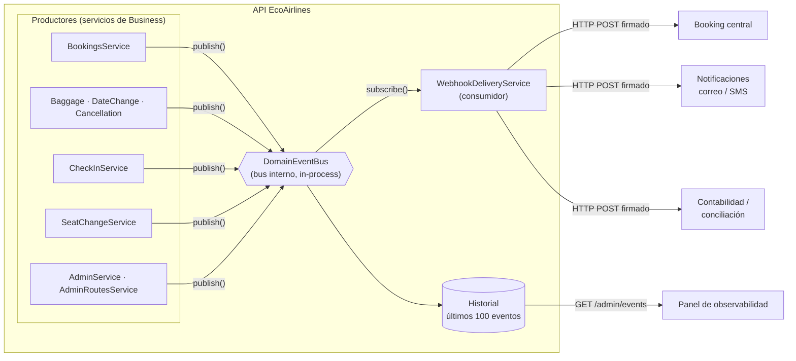
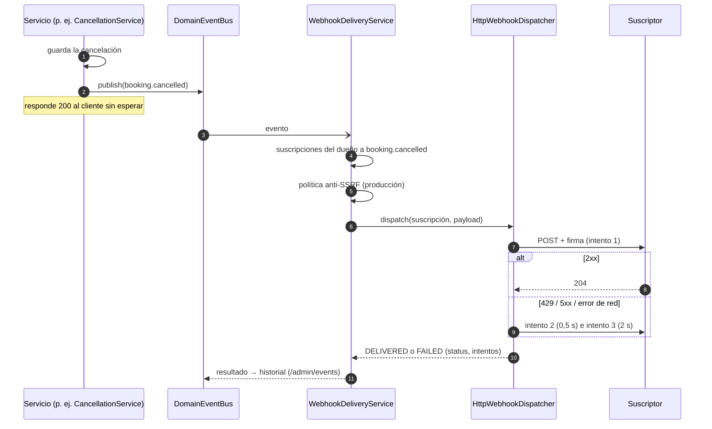

# EVENTOS — Diseño de eventos de EcoAirlines (SOA/EDA)

Cuando algo importante ocurre (una reserva confirmada, un vuelo cancelado, un cambio de horario), EcoAirlines **publica un evento**.
Los sistemas interesados se enteran sin tener que preguntar a la API cada cierto tiempo (*polling*).

- **Lo que define el contrato** (`vuelos-openapi.yaml`): el **catálogo de 12 eventos**, la **suscripción por webhooks**
  (`POST/GET/DELETE /webhooks`) y el **payload** (`WebhookPayload`).
- **Lo que agrega este documento:** quién produce cada evento, en qué momento, quién lo consume y cómo se entrega.

---

## 1. Arquitectura



| Pieza | Archivo | Qué hace |
|-------|---------|----------|
| Bus de eventos | `EcoAirlines.Business/src/common/events/domain-event-bus.ts` | `publish` / `subscribe`; guarda los últimos 100 eventos con sus entregas |
| Productores | Servicios de cada dominio | Publican el evento **después** de guardar el cambio |
| Consumidor de webhooks | `EcoAirlines.Business/src/services/webhooks/webhook-delivery.service.ts` | Busca las suscripciones al evento y las entrega |
| Envío HTTP | `EcoAirlines.DataManagement/src/gateways/webhooks/http-webhook-dispatcher.gateway.ts` | POST firmado con HMAC, con reintentos |
| Envío simulado | `noop-webhook-dispatcher.gateway.ts` | Solo registra el envío (pruebas: `WEBHOOK_DELIVERY=log`) |
| Panel | `GET /admin/events` + "Eventos de dominio y webhooks" en Observabilidad | Muestra cada evento y el resultado de su entrega |

**Principios:**
1. **Quien publica no conoce a quien consume.** Agregar un consumidor nuevo (notificaciones, contabilidad) es un `subscribe` más, sin
   tocar reservas ni postventa.
2. **El evento nunca rompe la operación.** Los consumidores corren después de responder al cliente; si uno falla, la reserva ya quedó
   guardada y el error se registra.
3. **Un solo formato.** El evento interno tiene la forma del `WebhookPayload` del contrato, así sale igual por el webhook.

---

## 2. Catálogo de eventos

| Evento | Produce | Momento | Datos (`data`) | Consumidores sugeridos | Estado |
|--------|---------|---------|----------------|------------------------|--------|
| `booking.confirmed` | bookings | Reserva confirmada: al crearla con pago aprobado (`201`) o cuando se confirma un pago pendiente | `bookingId`, `pnr`, `status` | Booking central (sincronizar), notificaciones (correo de confirmación), contabilidad (venta) | ✅ |
| `booking.ticket_issuing` | bookings | Reserva creada con pago pendiente (`202 PENDING_PAYMENT`) | `bookingId`, `pnr`, `status` | Booking central (mostrar "en proceso") | ✅ |
| `booking.ticket_issued` | bookings | Boletos emitidos (junto con `booking.confirmed`) | `bookingId`, `pnr`, `status`, `tickets` | Notificaciones (envío del e-ticket) | ✅ |
| `booking.changed` | post-sale / bookings | Cambio de fecha aplicado, o cambio de asiento | `bookingId`, `pnr`, `status`, `reason` (`DATE_CHANGE` o `SEAT_CHANGE`) y el detalle | Booking central, notificaciones | ✅ |
| `booking.baggage_added` | post-sale | Compra de maletas extra registrada (al momento o tras el pago pendiente) | `bookingId`, `pnr`, `status`, `passengerId`, `itineraryId`, `quantity` | Contabilidad (cobro adicional), aeropuerto (manifiesto de equipaje) | ✅ |
| `booking.cancelled` | post-sale | Reserva cancelada con su cotización | `bookingId`, `pnr`, `status`, `refundAmount` | Contabilidad (reembolso), booking central, notificaciones | ✅ |
| `booking.checked_in` | check-in | Check-in completado de un itinerario | `bookingId`, `pnr`, `status`, `itineraryId`, `passengers` | Notificaciones (pase de abordar), aeropuerto (embarque) | ✅ |
| `flight.cancelled` | admin (flight-status) | El administrador marca un vuelo como `CANCELLED` | `flightNumber`, `date`, `status` | Booking central (reacomodar pasajeros), notificaciones | ✅ |
| `flight.schedule_changed` | admin | Cambio de estado distinto de cancelación (p. ej. `DELAYED`), o **alta, cambio o baja de una ruta programada** | Vuelo: `flightNumber`, `date`, `status`. Ruta: `status` (`ROUTE_CREATED`, `ROUTE_UPDATED`, `ROUTE_REMOVED`), `routeId`, `flightNumbers`, `origin`, `destination`, `weekdays` | Booking central (actualizar el catálogo), notificaciones | ✅ |
| `booking.failed` | bookings | Un pago pendiente termina rechazado | `bookingId`, `pnr`, `status` | Booking central, notificaciones | ⏳ Diseñado: hoy la Payment API simulada siempre aprueba los pagos pendientes |
| `booking.ticket_failed` | bookings | La emisión de un boleto falla | `bookingId`, `pnr`, `status` | Soporte, booking central | ⏳ Diseñado: el GDS simulado no falla al emitir |
| `hold.expired` | offers | Un hold vence sin usarse (15 min) | `holdId`, `status` | Booking central (avisar al cliente) | ⏳ Diseñado: hoy el vencimiento se detecta al consultar el hold; requiere un proceso programado que lo revise |

**Quién recibe cada evento:**
- **`booking.*`:** solo las suscripciones del **dueño de la reserva** (el `sub` del JWT que la creó). Un sistema nunca recibe
  reservas ajenas.
- **`flight.*`:** todas las suscripciones a ese evento, porque el estado y el horario de un vuelo son públicos.

---

## 3. Formato del mensaje

Es el `WebhookPayload` del contrato:

```json
{
  "eventId": "9f1c2e7a-3b4d-4c5e-8f60-112233445566",
  "eventType": "booking.cancelled",
  "occurredAt": "2026-10-06T22:41:07.512Z",
  "apiVersion": "1.5.0.0",
  "data": {
    "bookingId": "6f079856-2142-4223-a940-14aa7bc13bf7",
    "pnr": "KB3B5Z",
    "status": "CANCELLED",
    "refundAmount": "209.80"
  }
}
```

- `data` lleva los campos del contrato (`bookingId`, `pnr`, `status`, `refundAmount`) y los propios de cada evento (tabla de la
  sección 2). El schema del contrato no prohíbe campos adicionales.
- **Nunca se envían** el dueño de la reserva, datos de pago ni documentos de los pasajeros.

### Cabeceras

| Cabecera | Ejemplo | Para qué |
|----------|---------|----------|
| `X-EcoAirlines-Event` | `booking.cancelled` | Enrutar sin leer el cuerpo |
| `X-EcoAirlines-Delivery` | el `eventId` | Descartar duplicados: un reintento trae el mismo id |
| `X-EcoAirlines-Signature` | `t=1791326471,v1=5b706dc9…` | Comprobar que lo envió EcoAirlines y que no fue alterado |

### Firma y cómo verificarla

`v1 = HMAC-SHA256(secret, "<t>.<cuerpo>")` en hexadecimal, donde `secret` es el que el suscriptor registró en `POST /webhooks` y `t`
es la marca de tiempo Unix. El receptor:
1. recalcula la firma con el cuerpo tal cual llegó;
2. la compara en tiempo constante;
3. rechaza marcas de tiempo de más de 5 minutos (evita repeticiones).

```js
import { createHmac, timingSafeEqual } from 'node:crypto';

function verify(rawBody, header, secret, toleranceSeconds = 300) {
  const { t, v1 } = Object.fromEntries(header.split(',').map((part) => part.split('=')));
  if (Math.abs(Date.now() / 1000 - Number(t)) > toleranceSeconds) return false;
  const expected = createHmac('sha256', secret).update(`${t}.${rawBody}`).digest('hex');
  return timingSafeEqual(Buffer.from(expected), Buffer.from(v1));
}
```

---

## 4. Entrega y reintentos



| Regla | Valor |
|-------|-------|
| Intentos | 3 (inmediato, a los 0,5 s y a los 2 s) |
| Tiempo máximo por intento | 5 s |
| Se reintenta ante | error de red, `429` y `5xx` |
| No se reintenta ante | `4xx` (el suscriptor rechazó el evento) |
| Éxito | cualquier `2xx` |
| Redirecciones | no se siguen (evita desviar el envío a otra URL) |

**Configuración:**
- `WEBHOOK_DELIVERY=http`: envía de verdad. Es el valor por defecto fuera de pruebas.
- `WEBHOOK_DELIVERY=log`: solo registra el envío. Es el valor por defecto con `NODE_ENV=test`.
- En producción la URL debe ser `https` con host público, y se vuelve a comprobar en cada envío.

**Garantía:** *al menos una vez* mientras la API esté encendida. El suscriptor debe ser idempotente y usar `X-EcoAirlines-Delivery`
para descartar duplicados.

---

## 5. Cómo probarlo

1. **Panel de administración** (usuario `admin@ecoairlines.test`):
   - hacer una reserva desde la web, o marcar un vuelo como cancelado en "Vuelos y asientos";
   - abrir **Observabilidad → Eventos de dominio y webhooks** para ver cada evento y su entrega.
2. **Con un receptor real:**
   - registrar en Swagger `POST /webhooks` con una URL de prueba (por ejemplo, de webhook.site) y los eventos deseados;
   - hacer una reserva y cancelarla: llegan `booking.confirmed`, `booking.ticket_issued` y `booking.cancelled`, con sus cabeceras de
     firma.
3. **Pruebas automáticas** (`EcoAirlines.API/test/events.e2e-spec.ts`). Un servidor local hace de suscriptor y se comprueba:
   - la firma;
   - que un cliente no recibe eventos de reservas ajenas;
   - que `flight.cancelled` llega a todos los suscriptores;
   - los 3 reintentos ante `503`;
   - el historial en `/admin/events`.

---

## 6. Evolución prevista

| Paso | Qué cambia | Por qué |
|------|------------|---------|
| 1. Persistir eventos (*outbox*) | Guardar el evento en la misma transacción que el cambio (tabla `outbox` en PostgreSQL) y publicarlo desde ahí | Hoy, si la API se reinicia entre el cambio y la entrega, el evento se pierde |
| 2. Broker de mensajes | Reemplazar `DomainEventBus` por RabbitMQ, Kafka o SNS/SQS con la misma interfaz `publish`/`subscribe` | Varias instancias de la API y consumidores en otros servicios |
| 3. Microservicios | Cada dominio en su servicio, con su base de datos; se comunican por eventos en lugar de llamar a `BookingsFacade` | Despliegue y escalado independientes |
| 4. Eventos pendientes | `hold.expired` (proceso programado), `booking.failed` y `booking.ticket_failed` (cuando los sistemas reales puedan fallar) | Completar el catálogo del contrato |
| 5. Reintentos diferidos | Cola de reintentos con espera creciente (minutos u horas) y "dead letter" | Suscriptores caídos por más tiempo |
